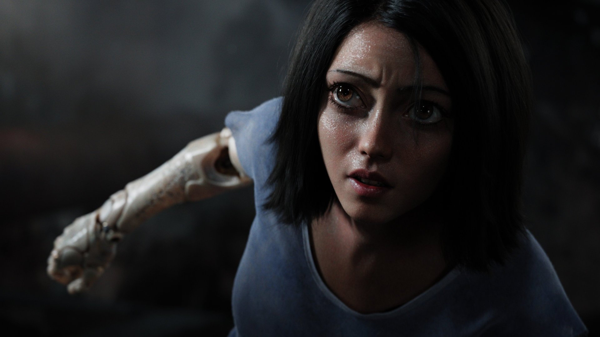
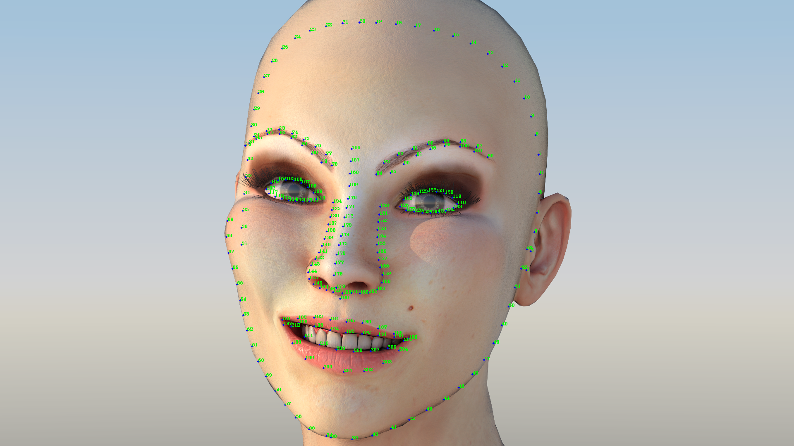

# 开源212点人脸关键点SDK实现抖音大眼特效

## 大眼特效

抖音短视频中的大眼特效有很多人玩，这篇就讲一下怎么实现。本文为《[抖音美颜效果开源实现，从AI到美颜全流程讲解](https://zhuanlan.zhihu.com/p/163604590)》姐妹篇，很多代码和内容都类似,看过的同学可以直接看源码。



## 大眼特效原理

大眼特效原理的美颜差不多，都是AI和计算机图形学的结合
>美颜是的基本原理就是深度学习加计算机图形学。深度学习用来人脸检测和人脸关键点检测。计算机图形学用来磨皮，瘦脸和画妆容。一般在Android上使用OpenGLES，IOS为Metal。

**看过[抖音美颜效果开源实现，从AI到美颜全流程讲解](https://zhuanlan.zhihu.com/p/163604590)的同学可以直接拉到最后看源码，和那篇基本大同小异**


## 人脸检测 & 人脸关键点
1. 人脸检测指的是对图片或者视频流中的人脸进行检测，并定位到图片中的人脸。
2. 人脸关键点检测是对人脸中五官和脸的轮廓进行关键点定位，一般情况下它紧接在人脸检测后。



我们将使用TengineKit来实现大眼特效。

## TengineKit
免费移动端实时人脸212关键点SDK。是一个易于集成的人脸检测和人脸关键点SDK。它可以在各种手机上以非常低的延迟运行。
<br>
https://github.com/OAID/TengineKit

### TengineKit 效果图


## 实现口红效果

### 配置 Gradle

Project中的build.gradle添加

```java
    repositories {
        ...
        mavenCentral()
        ...
    }

    allprojects {
        repositories {
            ...
            mavenCentral()
            ...
        }
    }
```

主Module中的build.gradle添加

```java
    dependencies {
        ...
        implementation 'com.tengine.android:tenginekit:1.0.5'
        ...
    }
```


### 配置 manifests

```xml
    <uses-permission android:name="android.permission.ACCESS_NETWORK_STATE" />
    <uses-permission android:name="android.permission.INTERNET"/>

    <uses-permission android:name="android.permission.READ_EXTERNAL_STORAGE"/>
    <uses-permission android:name="android.permission.WRITE_EXTERNAL_STORAGE"/>
    <uses-permission android:name="android.permission.READ_PHONE_STATE"/>
```

### 处理Gif传过来的图片流

首先我们先初始化TengineKit:
1. 选用normal处理模式
2. 打开人脸检测和人脸关键点功能
3. 设置图片流格式为RGBA
4. 设置输入图片流的宽高，此处为gif图的预览宽高
5. 设置输出图片流的宽高，此处为GifImageView的宽高，此处和gif一致，所以用gif图的宽高代替
```java
    com.tenginekit.Face.init(getBaseContext(),
        AndroidConfig.create()
                .setNormalMode()
                .openFunc(AndroidConfig.Func.Detect)
                .openFunc(AndroidConfig.Func.Landmark)
                .setInputImageFormat(AndroidConfig.ImageFormat.RGBA)
                .setInputImageSize(facingGif.getGifWidth(), facingGif.getGifHeight())
                .setOutputImageSize(facingGif.getGifWidth(), facingGif.getGifHeight())
    );
```

### 通过关键点得眼睛的中心点

```java
    Point getLeftEyeCenter(FaceLandmarkInfo fi){
        FaceLandmarkPoint p1 = fi.landmarks.get(105);
        FaceLandmarkPoint p2 = fi.landmarks.get(113);
        return new Point((int)((p1.X + p2.X) / 2), (int)((p1.Y + p2.Y) / 2));
    }

    Point getRightEyeCenter(FaceLandmarkInfo fi){
        FaceLandmarkPoint p1 = fi.landmarks.get(121);
        FaceLandmarkPoint p2 = fi.landmarks.get(129);
        return new Point((int)((p1.X + p2.X) / 2), (int)((p1.Y + p2.Y) / 2));
    }
```

### 眼睛放大算法

```java
public class MagnifyEyeUtils {
    /**
     *  眼睛放大算法
     * @param bitmap      原来的bitmap
     * @param centerPoint 放大中心点
     * @param radius      放大半径
     * @param sizeLevel    放大力度  [0,4]
     * @return 放大眼睛后的图片
     */
    public static Bitmap magnifyEye(Bitmap bitmap, Point centerPoint, int radius, float sizeLevel) {
        Bitmap dstBitmap = bitmap.copy(Bitmap.Config.RGB_565, true);
        int left = centerPoint.x - radius < 0 ? 0 : centerPoint.x - radius;
        int top = centerPoint.y - radius < 0 ? 0 : centerPoint.y - radius;
        int right = centerPoint.x + radius > bitmap.getWidth() ? bitmap.getWidth() - 1 : centerPoint.x + radius;
        int bottom = centerPoint.y + radius > bitmap.getHeight() ? bitmap.getHeight() - 1 : centerPoint.y + radius;
        int powRadius = radius * radius;

        int offsetX, offsetY, powDistance, powOffsetX, powOffsetY;

        int disX, disY;

        //当为负数时，为缩小
        float strength = (5 + sizeLevel * 2) / 10;

        for (int i = top; i <= bottom; i++) {
            offsetY = i - centerPoint.y;
            for (int j = left; j <= right; j++) {
                offsetX = j - centerPoint.x;
                powOffsetX = offsetX * offsetX;
                powOffsetY = offsetY * offsetY;
                powDistance = powOffsetX + powOffsetY;

                if (powDistance <= powRadius) {
                    double distance = Math.sqrt(powDistance);
                    double sinA = offsetX / distance;
                    double cosA = offsetY / distance;

                    double scaleFactor = distance / radius - 1;
                    scaleFactor = (1 - scaleFactor * scaleFactor * (distance / radius) * strength);

                    distance = distance * scaleFactor;
                    disY = (int) (distance * cosA + centerPoint.y + 0.5);
                    disY = checkY(disY, bitmap);
                    disX = (int) (distance * sinA + centerPoint.x + 0.5);
                    disX = checkX(disX, bitmap);
                    //中心点不做处理
                    if (!(j == centerPoint.x && i == centerPoint.y)) {
                        dstBitmap.setPixel(j, i, bitmap.getPixel(disX, disY));
                        //dstBitmap.setPixel(j, i, Color.WHITE);
                    }
                }
            }
        }
        return dstBitmap;
    }

    private static int checkY(int disY, Bitmap bitmap) {
        if (disY < 0) {
            disY = 0;
        } else if (disY >= bitmap.getHeight()) {
            disY = bitmap.getHeight() - 1;
        }
        return disY;
    }

    private static int checkX(int disX, Bitmap bitmap) {
        if (disX < 0) {
            disX = 0;
        } else if (disX >= bitmap.getWidth()) {
            disX = bitmap.getWidth() - 1;
        }
        return disX;
    }

}
```
此代码来源于 https://github.com/DingProg/Makeup

### 渲染
传过来的bitmap为RGB_565，需要转为标准的RGBA格式
```java
    facingGif.setOnFrameAvailable(new GifImageView.OnFrameAvailable() {
        @Override
        public Bitmap onFrameAvailable(Bitmap bitmap) {
            // bitmap RGB_565

            Bitmap out_bitmap = Bitmap.createBitmap(
                    facingGif.getGifWidth(),
                    facingGif.getGifHeight(),
                    Bitmap.Config.ARGB_8888);

            Canvas canvas = new Canvas(out_bitmap);

            canvas.drawBitmap(bitmap, 0, 0, null);
            bitmap.recycle();

            byte[] bytes = bitmap2Bytes(out_bitmap);
            Face.FaceDetect faceDetect = com.tenginekit.Face.detect(bytes);
            if(faceDetect.getFaceCount() > 0){
                faceLandmarks = faceDetect.landmark2d();
                if(faceLandmarks != null){
                    for (int i = 0; i < faceLandmarks.size(); i++) {
                        FaceLandmarkInfo fi = faceLandmarks.get(i);
                        out_bitmap = MagnifyEyeUtils.magnifyEye(out_bitmap, getLeftEyeCenter(fi), 40, 4);
                        out_bitmap = MagnifyEyeUtils.magnifyEye(out_bitmap, getRightEyeCenter(fi), 40, 4);
                    }
                }
            }
            return out_bitmap;
        }
    });
```

### 效果对比

原图|结果
:--:|:--:
 | 

## 建议

有兴趣的同学可以在当前项目的基础上面深化，具体可以参考
<br>
https://github.com/DingProg/Makeup


## 参考

1. [TengineKit - Free, Fast, Easy, Real-Time FaceDetection & FaceLandmark SDK on Mobile.](https://github.com/OAID/TengineKit)

2. [Makeup - 让你的“女神”逆袭，代码撸彩妆（画妆） ](https://github.com/DingProg/Makeup)

3. [CainCamera - CainCamera is an Android Project to learn about development of beauty camera, image and short video](https://github.com/DingProg/Makeup)
